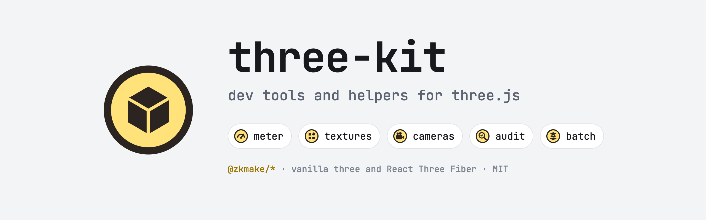
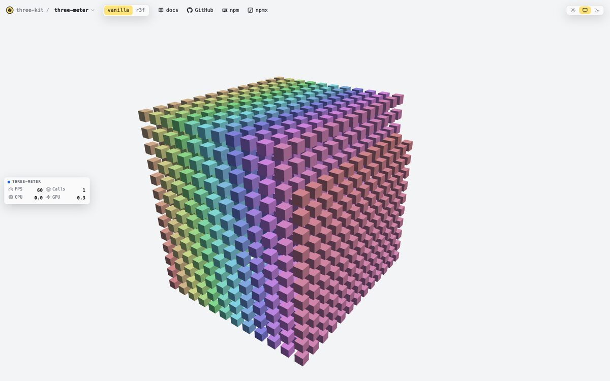
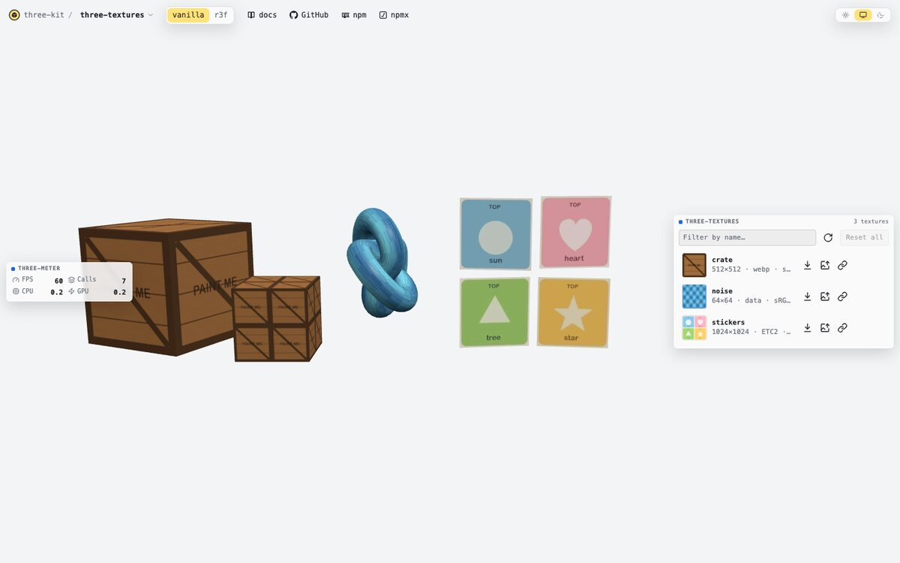
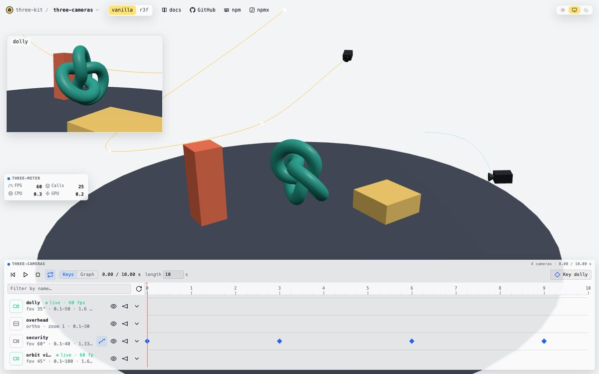

<picture>
  <source media="(prefers-color-scheme: dark)" srcset="docs/cover-dark.png">
  
</picture>

Tools and utilities for three.js, published separately under `@zkmake/*`. Each package has its own
version, changelog and README.

Site, with live demos and every README: [zkmake.github.io/three-kit](https://zkmake.github.io/three-kit/).
For coding agents, the same docs as markdown: [llms.txt](https://zkmake.github.io/three-kit/llms.txt) and
[llms-full.txt](https://zkmake.github.io/three-kit/llms-full.txt).

| Package                                                                                                                                   | What it is                                                                                                                          |                                                            |
| ----------------------------------------------------------------------------------------------------------------------------------------- | ----------------------------------------------------------------------------------------------------------------------------------- | ---------------------------------------------------------- |
|  [**three&#8209;meter**](packages/three-meter)          | Frame metrics (FPS, CPU, GPU, stutter, draw calls) with a dockable HUD.                                                             | [demo](https://zkmake.github.io/three-kit/three-meter/)    |
|  [**three&#8209;textures**](packages/three-textures) | Dev panel for a scene's textures: download, paint, swap back in live (KTX2 too), A/B, live-link files.                              | [demo](https://zkmake.github.io/three-kit/three-textures/) |
|  [**three&#8209;cameras**](packages/three-cameras)    | Dev panel for a scene's cameras: which are live, look through any one, edit it, keyframe moves and their paths.                     | [demo](https://zkmake.github.io/three-kit/three-cameras/)  |
|  [**three&#8209;audit**](packages/three-audit)          | Scene checks: z-fighting, NaN geometry, triangle budgets, draw-call ledgers, clearances. Runs in tests, the console and a glTF CLI. | [docs](https://zkmake.github.io/three-kit/three-audit/)    |
|  [**three&#8209;batch**](packages/three-batch)          | Fewer draws and triangles: culling cells, bakes, batches that follow moving objects, instance pools, far copies.                    | [docs](https://zkmake.github.io/three-kit/three-batch/)    |

All of them work with vanilla three and React Three Fiber.

## Demos

<table>
  <tr>
    <td width="33%" valign="top">
      <a href="https://zkmake.github.io/three-kit/three-meter/"><picture>
        <source media="(prefers-color-scheme: dark)" srcset="docs/demo-three-meter-dark.jpg">
        
      </picture></a>
      <b>three-meter</b>: what every frame costs, in a HUD you dock anywhere.
    </td>
    <td width="33%" valign="top">
      <a href="https://zkmake.github.io/three-kit/three-textures/"><picture>
        <source media="(prefers-color-scheme: dark)" srcset="docs/demo-three-textures-dark.jpg">
        
      </picture></a>
      <b>three-textures</b>: paint any texture the scene draws and see it lit, with no rebuild.
    </td>
    <td width="33%" valign="top">
      <a href="https://zkmake.github.io/three-kit/three-cameras/"><picture>
        <source media="(prefers-color-scheme: dark)" srcset="docs/demo-three-cameras-dark.jpg">
        
      </picture></a>
      <b>three-cameras</b>: every camera in the scene, a keyframe timeline, and paths you drag.
    </td>
  </tr>
</table>

## Layout

```
packages/<name>/   one published package each
apps/site/         zkmake.github.io/three-kit (Astro), built against the packages' source
configs/<name>/    shared config packages (TypeScript)
docs/              images the READMEs load
```

See [CONTRIBUTING.md](CONTRIBUTING.md) to work on a package or add a new one.

## License

MIT
